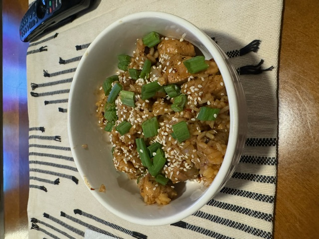

<html>
  
  <body class="recipeBody">
    <h1 text-align="center">Garlic Honey Chicken</h1>
    
    

      <h4>Ingredients</h4>
      <ul>
        <li>1 lb Salmon</li>
        <li>2 cups of couscous</li>
        <li>Green onion</li>
        <li>Sesame Seeds</li>
        <li>Honey Teriyaki Sauce</li>
          <ul>
            <li>Teriyaki sauce</li>
            <li>Honey</li>
            <li>Oil</li>
            <li>Black Pepper</li>
            <li>Garlic Powder</li>
            <li>Soy Sauce</li>
            <li>Cut from here</li>
            <li>Teriyaki sauce</li>
            <li>Honey</li>
            <li>Oil</li>
            <li>Black Pepper</li>
            <li>Garlic Powder</li>
            <li>Soy Sauce</li>
            <li>Teriyaki sauce</li>
            <li>Honey</li>
            <li>Oil</li>
            <li>Black Pepper</li>
            <li>Garlic Powder</li>
            <li>Soy Sauce</li>
            <li>Teriyaki sauce</li>
            <li>Honey</li>
            <li>Oil</li>
            <li>Black Pepper</li>
            <li>Garlic Powder</li>
            <li>Soy Sauce</li>
            <li>Teriyaki sauce</li>
            <li>Honey</li>
            <li>Oil</li>
            <li>Black Pepper</li>
            <li>Garlic Powder</li>
            <li>Soy Sauce</li>
            <li>Teriyaki sauce</li>
            <li>Honey</li>
            <li>Oil</li>
            <li>Black Pepper</li>
            <li>Garlic Powder</li>
            <li>Soy Sauce</li>
            <li>Teriyaki sauce</li>
            <li>Honey</li>
            <li>Oil</li>
            <li>Black Pepper</li>
            <li>Garlic Powder</li>
            <li>Soy Sauce</li>
            <li>Teriyaki sauce</li>
            <li>Honey</li>
            <li>Oil</li>
            <li>Black Pepper</li>
            <li>Garlic Powder</li>
            <li>Soy Sauce</li>
            <li>Teriyaki sauce</li>
            <li>Honey</li>
            <li>Oil</li>
            <li>Black Pepper</li>
            <li>Garlic Powder</li>
            <li>Soy Sauce</li>
            <li>Teriyaki sauce</li>
            <li>Honey</li>
            <li>Oil</li>
            <li>Black Pepper</li>
            <li>Garlic Powder</li>
            <li>Soy Sauce</li>
            <li>Teriyaki sauce</li>
            <li>Honey</li>
            <li>Oil</li>
            <li>Black Pepper</li>
            <li>Garlic Powder</li>
            <li>Soy Sauce</li>
            <li>Teriyaki sauce</li>
            <li>Honey</li>
            <li>Oil</li>
            <li>Black Pepper</li>
            <li>Garlic Powder</li>
            <li>Soy Sauce</li>
            <li>Teriyaki sauce</li>
            <li>Honey</li>
            <li>Oil</li>
            <li>Black Pepper</li>
            <li>Garlic Powder</li>
            <li>Soy Sauce</li>
            <li>Teriyaki sauce</li>
            <li>Honey</li>
            <li>Oil</li>
            <li>Black Pepper</li>
            <li>Garlic Powder</li>
            <li>Soy Sauce</li>
            <li>Teriyaki sauce</li>
            <li>Honey</li>
            <li>Oil</li>
            <li>Black Pepper</li>
            <li>Garlic Powder</li>
            <li>Soy Sauce</li>
          </ul>
      </ul>
    

    

      <h4>Recipe</h4>
      
This will be a step by step of the recipe.

    

    

      
Other important elements in this area could be: Cooktime, preptime, servings, inspiration

    

    

      <h4>About</h4>
      
This will be a short description of the dish and its importance to us/its history with us.

    

  </body>
</html>
